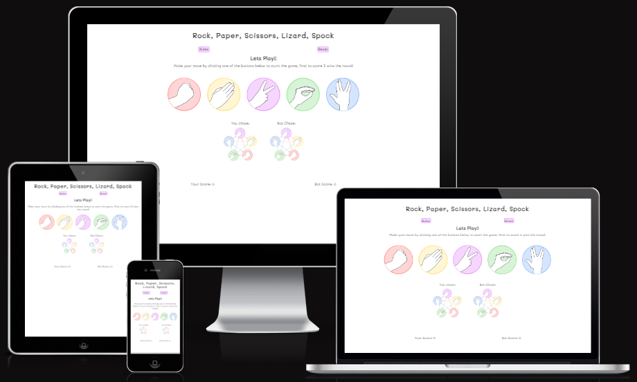
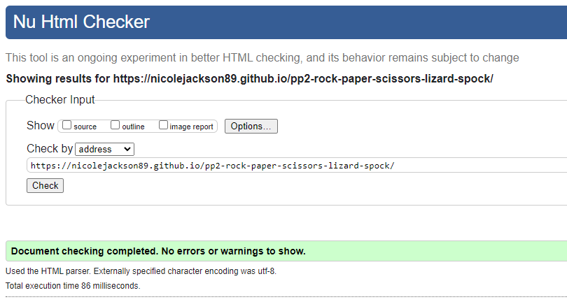
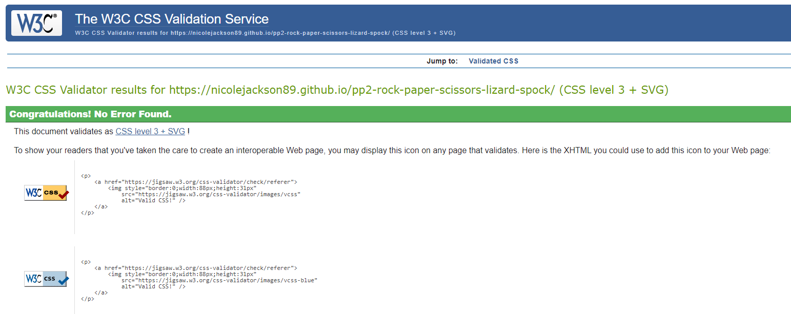
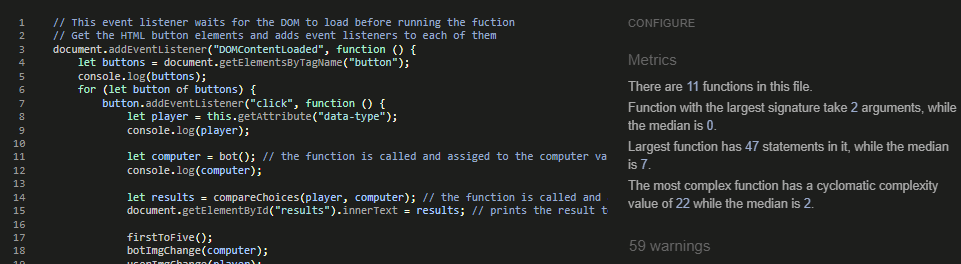
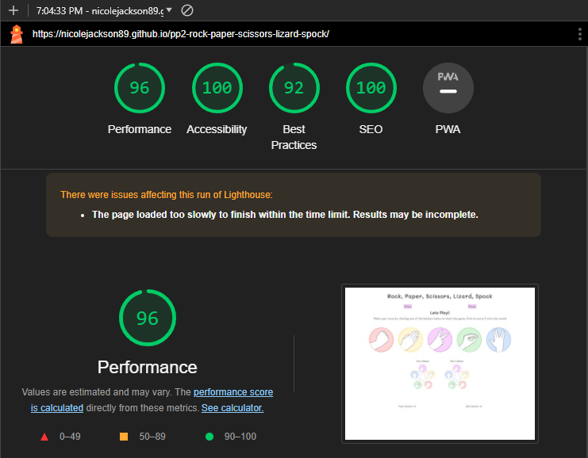
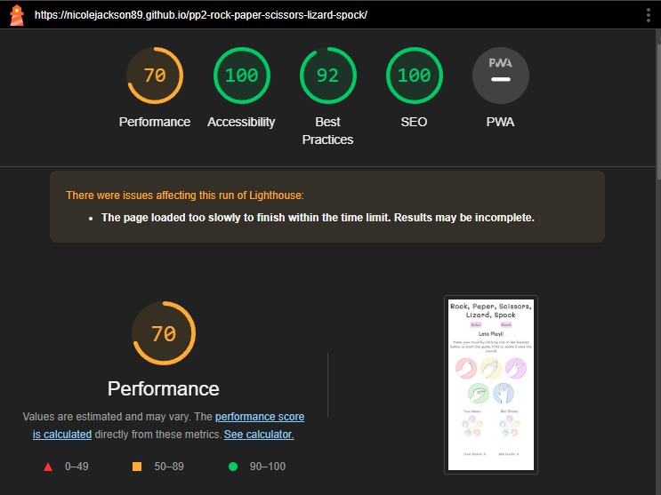

# Rock, Paper, Scissors, Lizard, Spock

### [View the live page here](https://nicolejackson89.github.io/pp2-rock-paper-scissors-lizard-spock/)

This web based strategy game, Rock Paper Scissors Lizard Spock, was made to target anyone who has minimal time available but enjoys a quick strategy game that can be played on any device against the computer/bot.

"Rock Paper Scissors Spock Lizard" was invented by Sam Kass and Karen Bryla, as "Rock Paper Scissors Spock Lizard". The expansion version works on the same principle as the original "Rock Paper Scissor" most of us played as kids but with the two additional weapons.

## User Experience

### Wireframe

### Color Palette

### Color Contrast

### Fonts

## Features

### Existing Features

### Future Features

## Testing

- The HTML, CSS & JavaScript code was tested using the W3C validator to fix any errors or warnings as well as JSHint.

### HTML Validator

- The HTML page was passed through the official [W3C HTML validator](https://validator.w3.org/) no errors were found.
- [Info messages](./assets/docs/html-validator-before.png) were shown for trailing slashes being used on end tags where they were not nessesary, the slashes were removed.

### CSS Validator

- No errors were found when validating my CSS code through the official [W3C CSS validator](https://jigsaw.w3.org/css-validator/).

### JavaScript Validator

- No errors were found when validating my JavaScript code through [JSHint](https://jshint.com/).
- 59 Warnings were found.

### Lighthouse

I used the Lighthouse Google Chrome dev tools feature to test the website in mobile and desktop view.

- Desktop

  - The performance score was good on desktop testing.

- Mobile

  - A lower performance score was received on the mobile testing.

### Manual Testing

### Known bugs and fixes

## Deployment

### [GitHub](https://github.com/) deployment

As this code is stored in GitHub, I deployed this webpage as follows:

1. Login to GitHub
2. Click the repository you wish to deploy (Top left corner)
3. In the navigation bar at the top, click 'Settings'
4. In the menu on the left-hand side, click 'Pages'
5. Under 'Source' select the drop down menu and click 'Deploy from a branch'
6. Under 'Branch' select the first drop down menu and click 'main' and save
7. The page will be given a URL as shown in the image below next to 'Your site is live at', this may take a few minutes to process before becoming visible.

### Cloning the GitHub repository

Cloning a repository will download a full copy of the data to your computer. This is useful when larger commits need to be pushed, adding or removing files and fixing merge conflicts.

1. Login to GitHub
2. Click the repository you wish to clone (Top left corner)
3. Click 'Code' which is shown above the list of files in the repository
4. Click the 'Local' tab, copy the HTTPS URL
5. Open Codeanywhere, click 'New Workspace'
6. Paste the copied URL into the space given under 'Repository URL'
7. Click 'Create' and the local clone will be created.

### Forking the GitHub repository

Forking a GitHub repository will allow you to make a copy of the repository, changes can be then be made that will not affect the original repository. This is useful for proposed changes, ideas or fixes to an original repository.

1. Login to GitHub
2. Click the repository you wish to fork (Top left corner)
3. Click the 'Fork' drop down in the top right-hand corner
4. Then click 'Create a new fork' you will now have a copy to work on.

## Technologies Used

## Credits

## Acknowledgements
