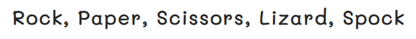

# Rock, Paper, Scissors, Lizard, Spock

### [View the live page here](https://nicolejackson89.github.io/pp2-rock-paper-scissors-lizard-spock/)

This web-based strategy game, Rock Paper Scissors Lizard Spock, was made to target anyone who has minimal time available but enjoys a quick strategy game that can be played on any device against the computer/bot.

"Rock Paper Scissors Spock Lizard" was invented by Sam Kass and Karen Bryla, as "Rock Paper Scissors Spock Lizard". The expansion version works on the same principle as the original "Rock Paper Scissor" most of us played as kids but with the two additional weapons.

## User Experience

### Strategy

Rock, Paper, Scissors, Lizard, Spock was made as a web-based game for users who are familiar with The Big Bang Theory series where this expansion version of Rock, Paper, Scissors was aired in a few episodes.

- Target users are of any age, who may not have much time available, enjoy short periods of easily accessible and responsive web-based games from any device.
- A second player is not needed as this game has a Bot as the opponent.
- A Rules page has been added for new users or users needing a refresher on game rules.
- The game ends once a score of 5 is reached by the User/Bot.
- A Reset button is been provided If the user would like to restart the game at any point.
- Score is shown for the progress of the game for the User and the Bot.
- There is a section showing the Bot and User choices of the game that has just been played.

### Scope

Content features are as follows:

- Rules section for all users where needed
- Reset option to restart the game and all controls, results, scores
- Game controls area where the user can easily interact with choices available
- Choice area showing the user-chosen move as well as the choice of the bot for each round
- Results section below this returning the choices made and the round winner
- Score section for both the user and bot scores.

### Structure

The game consists of one main page where the game is made available to play once the page has been loaded.

- The game page consists of a user-friendly, easy to follow and uncomplicated layout:
  - Rules button
  - Reset button
  - Controls are
  - Choice/results area
  - Score area

### Surface

#### Wireframe

The [wireframe](./assets/docs/wireframe.png) created using paint consists of the following:

- The Rules and Reset buttons are placed at the top of the pages for users to access these easily
- Game instructions so the user knows the first to score 5 wins the round
- Controls area for the user to interact with for the game round to begin
- The user and bot choice area where the user can visually see the choices made
- A section stating who the winner of the round is example: "You chose spock, the bot chose paper - Paper disproves Spock, you lose!" gets printed to window. This was an addition to the original plan for the layout as I thought it would be a better user experience to have this
- The rules section with an added diagram for visual understanding of the winning combinations, a close button to redirect to the game page

#### Color Palette

The color palette used for the web page was minimalistic as the buttons the user would interact with are colorful, the look and feel I wanted for the web-based game was playful but easy on the eye. I achieved this by making use of mostly Hex colors throughout with a simple white background.

#### Color Contrast

After running the website through a color contrast validator, the chosen colors work well together.

#### Fonts & Icons

I made use of Google fonts one main font was used, 'Mali' and 'sans-serif' as a backup font. 'Mali' was used throughout the game web page as I felt it was a playful but readable font.

A favicon was added to the page in the form of a "Spock" hand symbol as this is the Lizard, Spock expansion version of the original game.

#### Images

The images for the user buttons and choices on this page were edited from the original diagram for winning combinations to beep with the theme and color scheme. I felt these were appropriate to use together to complete the look of the page.

## Features

### Existing Features

The web page game was designed to be played on almost any device and fits well without the need to scroll while playing a game.

- Logo
  - The Logo was styled in the center of any page for an easy flow to the page on any screen size.

- Navigation
  - Users can easily navigate to these pages using any device
  - Rules button: Opens option of the game page
  - Reset button: Reloads the game page, score, all buttons
  - The buttons have been styled with a darker opacity and zoom effect on hover.

- Introduction
  - Users see that by clicking on a button / making a move the game will start
  - They will also see that there will be a win after they or the bot reaches a score of 5.

- User Controls
  - Users make a move by interacting with one of five buttons consisting of images of the options they can choose
  - The buttons were styled with a 360-degree spin on hover for playfulness and visual effect.

- Choice area
  - Users make a move by interacting with one of five buttons in the controls area, the chosen image will then replace the placeholder images.
  - The bot choice will also be displayed after the user has made his/her move.

- Results area
  - After the user and bot move has been made, this area returns the results of the choices made per round as well as updates who the winner of that move is, the tie game and the winner of the 5 rounds played also updates here.

- Score area
  - The user and bot scores increment here till they reach 5 which then resets the score to 0 on both unless the Reset button is clicked sooner.

- Rules
  - The rules section has been styled inside of an overlay so that the buttons in the background do not interfere while this section is active
  - A close button was added to easily redirect to the game page with identical styling as the game page buttons (Rules & Reset).

### Future Features

Possible future features could be:

- Additional expansion options to the game like adding the original Rock, Paper, Scissors etc
- Adding the option for a user to choose how many rounds are to be played before a win is announced
- Users being able to login before starting the game and creating a save option to track high scores over time.

## Testing

- The HTML, CSS & JavaScript code was tested using the W3C validator to fix any errors or warnings as well as JSHint.

### HTML Validator

- The HTML page was passed through the official [W3C HTML validator](https://validator.w3.org/) no errors were found.
- [Info messages](./assets/docs/html-validator-before.png) were shown for trailing slashes being used on end tags where they were not necessary, the slashes were removed.

### CSS Validator

- No errors were found when validating my CSS code through the official [W3C CSS validator](https://jigsaw.w3.org/css-validator/).

### JavaScript Validator

#### Testing - Before fixes

- No errors were found when validating my JavaScript code through [JSHint](https://jshint.com/).
- 59 Warnings were found, some of these were fixed by adding the correct version to the test before placing the JavaScript code.
- Other fixes were related to the userImgChange & botImgChange functions. The return statement was moved to below each "else if" condition.

#### Testing - After fixes

- 1 Warning was found in my event listener due to the loop, I made a concise decision to leave this as is as this runs the main function for the game.

### Lighthouse

I used the Lighthouse Google Chrome dev tools feature to test the website in mobile and desktop view.

- Desktop

  - The performance score was good on desktop testing.

- Mobile

  - A lower performance score was received on the mobile testing due to image sizes.

### Manual Testing

|What was tested|Result|
|---|---|
|Rules button: Opens on top of the page content when clicked|Passed|
|Close button in rules: Closes when clicked|Passed|
|Reset button: Reloads the page and all buttons|Passed|
|User/bot - selection & scores: When a user/bot takes his/her turn that the images show in the choice placeholder and scores increment correctly|Passed|

### Known bugs and fixes

|What was tested / Expected results|Actual Results|What was done to fix the bug|
|---|---|---|
|Rules button - The rules popup section was meant to display|The popup became visible but "Undefined" was also returned in the results section when clicked due to the main game function and loop|The buttons were replaced with divs to correct this|
|"Rules, Close & Reset" buttons - Mouse pointer when hovered over|Text insertion I beam cursor|The pointer curser was specified in CSS to fix this|
|Game rules popup active - The game in the background would be inactive / not clickable|User selection/controls were still active and clickable|An overlay was placed around the rules section, visibility was changed to display in CSS for styling|

## Deployment

### [GitHub](https://github.com/) deployment

As this code is stored in GitHub, I deployed this webpage as follows:

1. Login to GitHub
2. Click the repository you wish to deploy (Top left corner)
3. In the navigation bar at the top, click 'Settings'
4. In the menu on the left-hand side, click 'Pages'
5. Under 'Source' select the drop down-menu and click 'Deploy from a branch'
6. Under 'Branch' select the first drop-down menu and click 'main' and save
7. The page will be given a URL as shown in the image below next to 'Your site is live at', this may take a few minutes to process before becoming visible.

### Cloning the GitHub repository

Cloning a repository will download a full copy of the data to your computer. This is useful when larger commits need to be pushed, adding or removing files and fixing merge conflicts.

1. Login to GitHub
2. Click the repository you wish to clone (Top left corner)
3. Click 'Code' which is shown above the list of files in the repository
4. Click the 'Local' tab, copy the HTTPS URL
5. Open Codeanywhere, click 'New Workspace'
6. Paste the copied URL into the space given under 'Repository URL'
7. Click 'Create' and the local clone will be created.

### Forking the GitHub repository

Forking a GitHub repository will allow you to make a copy of the repository, changes can then be made that will not affect the original repository. This is useful for proposed changes, ideas, fixes to an original repository.

1. Login to GitHub
2. Click the repository you wish to fork (Top left corner)
3. Click the 'Fork' drop-down in the top right-hand corner
4. Then click 'Create a new fork' you will now have a copy to work on.

## Technologies Used

- [HTML](https://en.wikipedia.org/wiki/HTML)
  - HTML was used to structure the content of the web page
- [CSS](https://en.wikipedia.org/wiki/CSS)
  - CSS was used to style the content of the web page
- [JavaScript](https://en.wikipedia.org/wiki/JavaScript)
  - JavaScript was used for the interactivity & functionality of the web page
- [Google Fonts](https://fonts.google.com/)
  - Google Fonts was used to style the font throughout the web page
- [Chrome DevTools](https://developer.chrome.com/docs/devtools/)
  - DevTools was used throughout the process of creating the web page to find bugs and test responsiveness on elements etc.
- [Favicon.io](https://favicon.io/)
  - Favicon was used to generate the icon for the web page
- [TinyPNG](https://tinypng.com/)
  - TinyPNG was used to resize the images on the page & buttons for faster loading time
- [Codeanywhere](https://codeanywhere.com/)
  - Codeanywhere was used as the development environment for this web page
- [GitHub](https://github.com/)
  - GitHub is being used to store the code for this web page
- [Color Contrast Accessibility Validator](https://color.a11y.com/)
  - Color Contrast Validator was used to test the web pages color contrast
- [W3C Markup Validation](https://validator.w3.org/)
  - W3C validator was used to validate all the HTML code in the web page
- [W3C CSS Validation](https://jigsaw.w3.org/css-validator/)
  - W3C validator was used to validate all the CSS code in the web page
- [Free Formatter](https://www.freeformatter.com/)
  - Free formatter was used to format the CSS and HTML code throughout the web page
- [Am I Responsive?](https://ui.dev/amiresponsive)
  - Used to for the image in the README file
- [Coolors](https://coolors.co/)
  - Coolors was used to generate the colors for the webpage as well as create RGB codes
- [Online PNG Tools](https://onlinepngtools.com/crop-png)
  - Used to crop the winning combinations image into 5 separate images for the user option buttons
- [Image Color Picker](https://imagecolorpicker.com/en)
  - Used to get the main color from one of the buttons to use throughout the page
- [Short URL](https://www.shorturl.at/)
  - Used to shorten URL links
- [Grammarly](https://app.grammarly.com/)
  - Used to check grammer and spelling
- [JSHint](https://jshint.com/)
  - Used to validate the JavaScript code

## Credits

- Game, rules, some text content used from here:
  - [The Big Bang Theory Wiki](https://bigbangtheory.fandom.com/wiki/Rock,_Paper,_Scissors,_Lizard,_Spock)
- Images & Favicon was found/downloaded from:
  - [The Big Bang Theory Wiki](https://bigbangtheory.fandom.com/wiki/Rock,_Paper,_Scissors,_Lizard,_Spock)
  - [Clip Art Max](https://www.clipartmax.com/)
- For guidance and direction with JavaScript and some aspects of the web page-bulding process:
  - [Love Maths Project](https://github.com/NicoleJackson89/love-maths)
  - [JavaScript Tutorial - innerHTML](https://www.javascripttutorial.net/javascript-dom/javascript-innerhtml/)
  - [W3 Schools - HTML Favicon](https://www.w3schools.com/html/html_favicon.asp)
- This code was used for the 360-degree rotation on the user buttons and amended to my preference and needs:
  - [Stack Overflow - Spin or rotate an image on hover](https://stackoverflow.com/questions/23695090/spin-or-rotate-an-image-on-hover)
- Modal box and overlay was created with guidance from these sites:
  - [W3 Schools - CSS/JS Modal](https://www.w3schools.com/howto/howto_css_modals.asp)
  - [W3 Schools - Overlay](https://www.w3schools.com/howto/howto_css_overlay.asp)
  - [Free Code Camp](https://www.freecodecamp.org/news/css-display-none-and-visibility-hidden-the-difference/#:~:text=display%3Anone%20turns%20off%20the,elements%20without%20changing%20their%20layouts)
- Reset button code and guidance was taken here:
  - [Stack Overflow - Button that refreshes the page on click](https://stackoverflow.com/questions/29884654/button-that-refreshes-the-page-on-click)
- Slack community for guidance:
  - [Slack Community](https://app.slack.com/client/T0L30B202/C027C3PLS1W)

## Acknowledgements

Thank you to my mentor Mitko Bachvarov for his guidance, advice, support as well as my husband and fellow student Iain Jackson for his advice, motivation, troubleshooting assistance throughout the process of this project.
